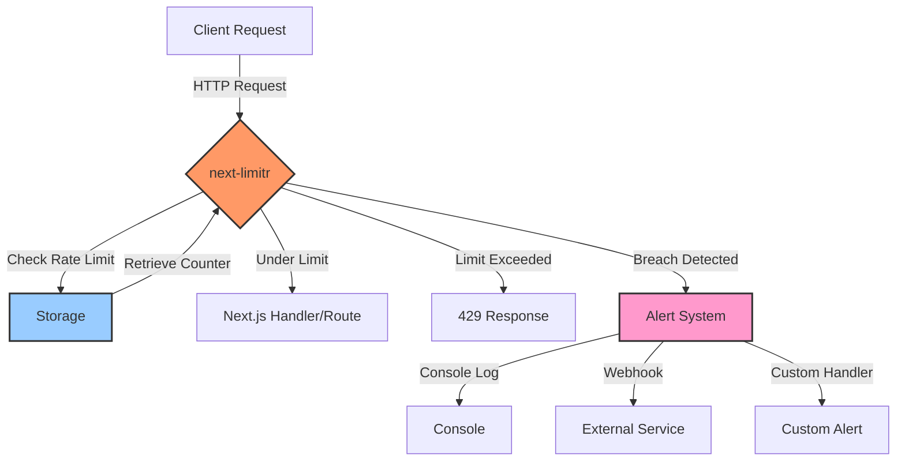
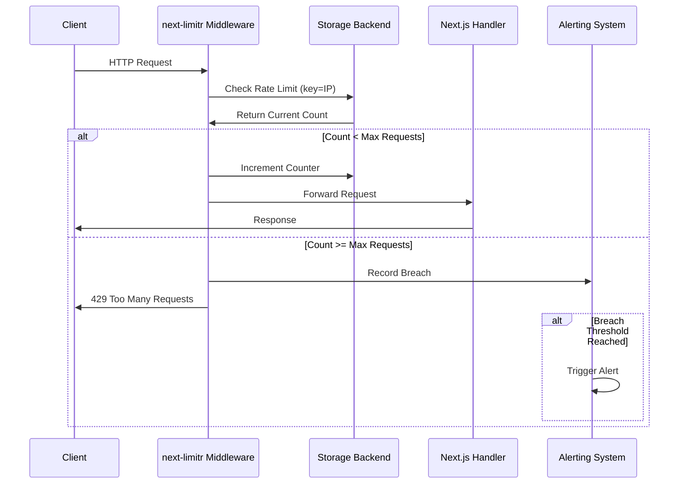
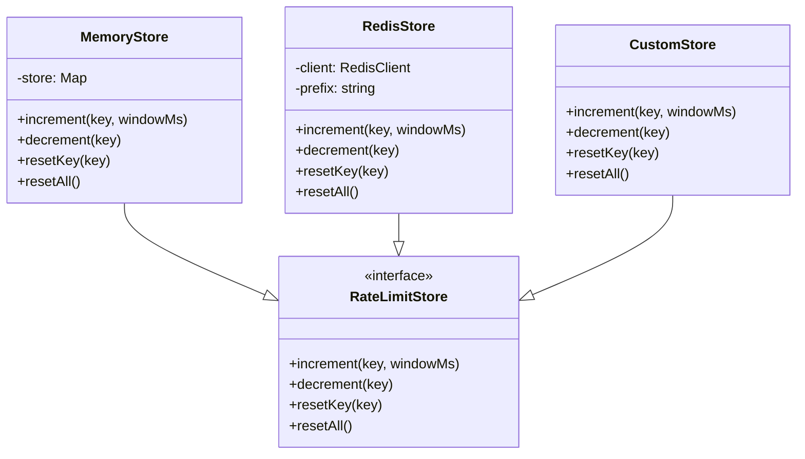
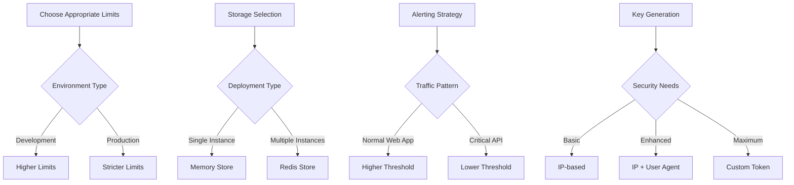

# next-limitr

A simple and effective rate limiting and alerting package for Next.js.

[](https://www.npmjs.com/package/next-limitr)
[](https://github.com/pallepadehat/next-limitr/blob/main/LICENSE)
[](https://www.npmjs.com/package/next-limitr)

## Features

- ⚡ **Simple Setup**: Easy to integrate into any Next.js application
- 🔒 **API Route Protection**: Rate limit API routes with a simple middleware
- 🌍 **Edge Middleware Support**: Works with Next.js Edge runtime and App Router
- 📊 **Rate Limiting**: Configure limits based on IP address or custom identifiers
- 🚨 **Alerting**: Get notified when someone is hammering your API
- 🧱 **Extensible**: Customize storage and alerting mechanisms

## Architecture Overview



## Installation

```bash
npm install next-limitr
# or
yarn add next-limitr
# or
pnpm add next-limitr
```

## Basic Usage

### Protecting API Routes (Pages Router)

```typescript
// pages/api/example.ts
import { rateLimiter } from "next-limitr";

// Create a rate limiter middleware that allows 5 requests per minute
const limiter = rateLimiter({
  maxRequests: 5,
  windowMs: "1m",
});

async function handler(req, res) {
  // Your API logic here
  res.status(200).json({ message: "Hello World" });
}

// Apply the rate limiter to the handler
export default limiter(handler);
```

### Using with Edge Middleware (App Router)

```typescript
// middleware.ts
import { NextResponse } from "next/server";
import { edgeRateLimiter } from "next-limitr";

// Create a rate limiter for Edge runtime
const limiter = edgeRateLimiter({
  maxRequests: 20,
  windowMs: "1m",
});

export async function middleware(req) {
  return limiter(req);
}

// Apply only to API routes
export const config = {
  matcher: "/api/:path*",
};
```

## How It Works



## Configuration Options

### Rate Limiter Options

| Option         | Type               | Default                                        | Description                                               |
| -------------- | ------------------ | ---------------------------------------------- | --------------------------------------------------------- |
| `maxRequests`  | `number`           | `100`                                          | Maximum number of requests allowed within the window      |
| `windowMs`     | `number \| string` | `60000`                                        | Time window in milliseconds or string (e.g., '1m', '1h')  |
| `message`      | `string`           | `'Too many requests, please try again later.'` | Custom message for rate limit exceeded response           |
| `statusCode`   | `number`           | `429`                                          | HTTP status code for rate limit exceeded response         |
| `headers`      | `boolean`          | `true`                                         | Whether to add rate limit headers to responses            |
| `keyGenerator` | `Function`         | IP-based                                       | Function to generate a unique identifier for each request |
| `store`        | `RateLimitStore`   | `MemoryStore`                                  | Custom storage implementation                             |
| `skip`         | `Function`         | `undefined`                                    | Function to determine if rate limiting should be skipped  |
| `alerting`     | `AlertingOptions`  | `undefined`                                    | Options for alerting on rate limit breaches               |

### Alerting Options

| Option       | Type               | Default     | Description                                     |
| ------------ | ------------------ | ----------- | ----------------------------------------------- |
| `threshold`  | `number`           | `5`         | Number of breaches before an alert is triggered |
| `windowMs`   | `number \| string` | `60000`     | Time window for counting breaches               |
| `consoleLog` | `boolean`          | `true`      | Whether to log alerts to the console            |
| `webhookUrl` | `string`           | `''`        | URL to send webhook alerts to                   |
| `handler`    | `Function`         | `undefined` | Custom function to handle alerts                |

## Storage Adapters

next-limitr comes with built-in storage adapters and supports custom implementations.



### Memory Store (Default)

Suitable for single-instance deployments or development environments.

```typescript
import { rateLimiter, MemoryStore } from "next-limitr";

const store = new MemoryStore();
const limiter = rateLimiter({
  maxRequests: 10,
  windowMs: "1m",
  store: store,
});
```

### Redis Store

Recommended for production deployments with multiple instances.

```typescript
import { rateLimiter, RedisStore } from "next-limitr";
import Redis from "ioredis";

const redisClient = new Redis({
  host: "localhost",
  port: 6379,
});

const store = new RedisStore({
  client: redisClient,
  prefix: "rate-limit:",
});

const limiter = rateLimiter({
  maxRequests: 100,
  windowMs: "1m",
  store: store,
});
```

## Advanced Usage

### Custom Key Generator

```typescript
import { rateLimiter } from "next-limitr";

// Rate limit based on a combination of IP and user agent
const limiter = rateLimiter({
  maxRequests: 10,
  windowMs: "1m",
  keyGenerator: (req) => {
    const ip = req.headers["x-forwarded-for"] || req.socket.remoteAddress;
    const userAgent = req.headers["user-agent"] || "unknown";
    return `${ip}-${userAgent}`;
  },
});
```

### Skip Rate Limiting

```typescript
import { rateLimiter } from "next-limitr";

// Skip rate limiting for authenticated users
const limiter = rateLimiter({
  maxRequests: 5,
  windowMs: "1m",
  skip: (req) => {
    // Skip for admin users
    return req.headers.authorization === "Bearer admin-token";
  },
});
```

### Alerting Integration

```typescript
import { rateLimiter } from "next-limitr";

// Set up rate limiting with alerting
const limiter = rateLimiter({
  maxRequests: 10,
  windowMs: "1m",
  alerting: {
    threshold: 3, // Alert after 3 breaches
    windowMs: "5m", // Within a 5 minute window
    consoleLog: true, // Log to console
    webhookUrl: "https://hooks.slack.com/services/YOUR/SLACK/WEBHOOK", // Send to Slack
    handler: async (data) => {
      // Custom alert handling
      await sendEmail({
        subject: "Rate Limit Breach Detected",
        body: `IP ${data.key} has exceeded rate limits ${data.breachCount} times.`,
      });
    },
  },
});
```

## Best Practices



### Recommended Rate Limits

| API Type           | Recommended Limits     | Reasoning                                   |
| ------------------ | ---------------------- | ------------------------------------------- |
| Public API         | 20-60 per minute       | Balance between availability and protection |
| Authenticated API  | 100-300 per minute     | Higher trust for authenticated users        |
| Critical Endpoints | 5-10 per minute        | Extra protection for sensitive operations   |
| Static Content     | No limits or very high | Optimized for CDN delivery                  |

## Troubleshooting

### Common Issues

1. **Rate limit too aggressive**: Increase `maxRequests` or `windowMs`
2. **Memory leaks with MemoryStore**: Implement regular cleanup or use RedisStore
3. **False positives behind proxies**: Configure proper IP extraction for your environment

### Debug Mode

Enable debug mode for additional logging:

```typescript
import { rateLimiter } from "next-limitr";

const limiter = rateLimiter({
  maxRequests: 10,
  windowMs: "1m",
  debug: true, // Enables detailed logging
});
```

## Performance Considerations

The middleware is designed to be as lightweight as possible, with minimal impact on request processing time.

```mermaid
gantt
    title Request Processing Timeline
    dateFormat  X
    axisFormat %L ms

    section Without Rate Limiting
    Request Processing : 0, 50

    section With Memory Store
    Rate Limit Check   : 0, 1
    Request Processing : 1, 51

    section With Redis Store
    Rate Limit Check   : 0, 10
    Request Processing : 10, 60
```



## Contributing

We welcome contributions! Please see [CONTRIBUTING.md](CONTRIBUTING.md) for details.

## License

MIT
