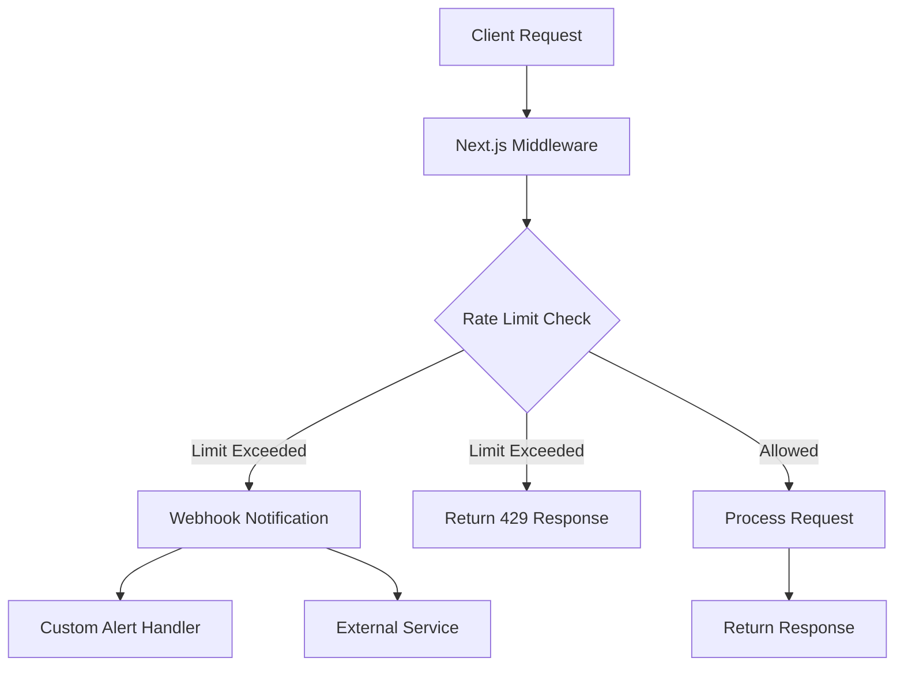
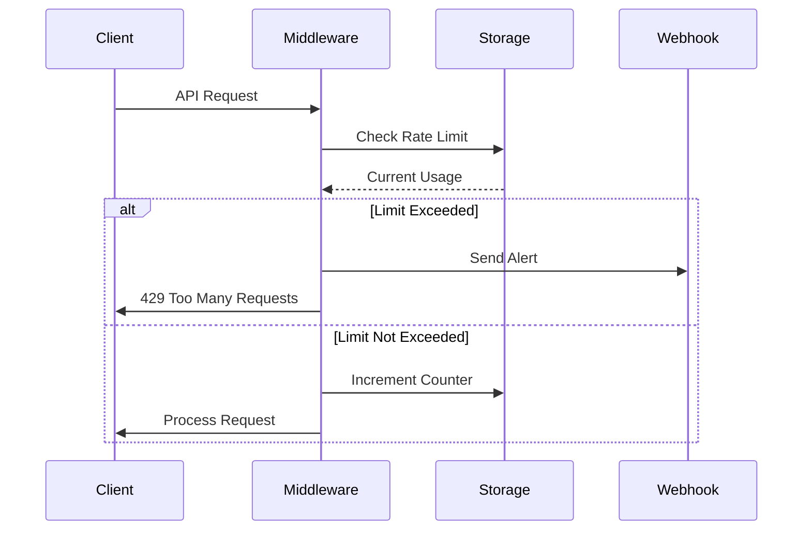

# Next-Limitr

A powerful and flexible rate limiting middleware for Next.js APIs with built-in webhook support and customizable alerts.

## Features

- 🚀 Easy integration with Next.js API routes and Edge functions
- 🔒 Multiple rate limiting strategies (fixed window, sliding window, token bucket)
- 🔔 Built-in webhook notifications for rate limit violations
- 📊 Custom alert handlers and monitoring
- 💾 Multiple storage backends (Memory, Redis)
- ⚡ Zero-config defaults with extensive customization options
- 🎯 Path-based and dynamic rate limiting
- 🔍 Detailed rate limit information in response headers

## Installation

```bash
npm install next-limitr
# or
yarn add next-limitr
# or
pnpm add next-limitr
```

## Quick Start

```typescript
// app/api/hello/route.ts
import { withRateLimit } from "next-limitr";

export const GET = withRateLimit({
  limit: 10,
  windowMs: 60000, // 1 minute
})(async (req) => {
  return Response.json({ message: "Hello World!" });
});
```

## Architecture



## Rate Limiting Flow



## Configuration Options

### Basic Configuration

```typescript
import { withRateLimit } from "next-limitr";

export const POST = withRateLimit({
  // Basic options
  limit: 100, // Maximum number of requests
  windowMs: 900000, // 15 minutes

  // Storage options
  storage: "redis", // 'memory' or 'redis'
  redisConfig: {
    host: "localhost",
    port: 6379,
  },

  // Webhook configuration
  webhook: {
    url: "https://api.example.com/rate-limit-alert",
    headers: {
      Authorization: "Bearer your-token",
    },
  },

  // Custom response
  handler: (req, res) => {
    return new Response("Rate limit exceeded", {
      status: 429,
      headers: {
        "Retry-After": "900",
      },
    });
  },
})(async (req) => {
  // Your API logic here
});
```

### Advanced Configuration

```typescript
import { withRateLimit, RateLimitStrategy } from "next-limitr";

export const GET = withRateLimit({
  // Use different strategies
  strategy: RateLimitStrategy.SLIDING_WINDOW,

  // Dynamic limits based on user or request
  getLimitForRequest: async (req) => {
    const user = await getUser(req);
    return user.isPremium ? 1000 : 100;
  },

  // Custom key generation
  keyGenerator: (req) => {
    return `${req.ip}-${req.headers.get("user-agent")}`;
  },

  // Custom alert handling
  onLimitReached: async (req, usage) => {
    await sendSlackNotification({
      channel: "#api-alerts",
      message: `Rate limit exceeded for IP ${req.ip}`,
      usage,
    });
  },
})(async (req) => {
  // Your API logic here
});
```

## Response Headers

The middleware adds the following headers to all responses:

- `X-RateLimit-Limit`: Maximum number of requests allowed
- `X-RateLimit-Remaining`: Number of requests remaining in the current window
- `X-RateLimit-Reset`: Time when the rate limit resets (Unix timestamp)
- `Retry-After`: Seconds until requests can be made again (only on 429 responses)

## Storage Backends

### Memory Storage

Suitable for single-instance deployments or development:

```typescript
import { withRateLimit } from "next-limitr";

export const GET = withRateLimit({
  storage: "memory",
  limit: 100,
  windowMs: 900000,
})(handler);
```

### Redis Storage

Recommended for production and multi-instance deployments:

```typescript
import { withRateLimit } from "next-limitr";

export const GET = withRateLimit({
  storage: "redis",
  redisConfig: {
    host: process.env.REDIS_HOST,
    port: parseInt(process.env.REDIS_PORT!),
    password: process.env.REDIS_PASSWORD,
  },
})(handler);
```

## Webhook Integration

Configure webhooks to receive notifications when rate limits are exceeded:

```typescript
import { withRateLimit } from "next-limitr";

export const GET = withRateLimit({
  webhook: {
    url: "https://api.example.com/alerts",
    method: "POST",
    headers: {
      Authorization: "Bearer your-token",
    },
    payload: (req, usage) => ({
      ip: req.ip,
      path: req.nextUrl.pathname,
      usage,
      timestamp: new Date().toISOString(),
    }),
  },
})(handler);
```

## Contributing

Contributions are welcome! Please read our [Contributing Guide](CONTRIBUTING.md) for details on our code of conduct and the process for submitting pull requests.

## License

This project is licensed under the MIT License - see the [LICENSE](LICENSE) file for details.
